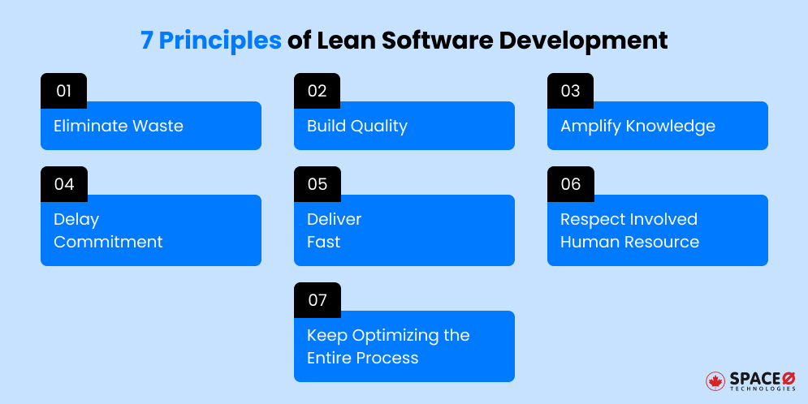
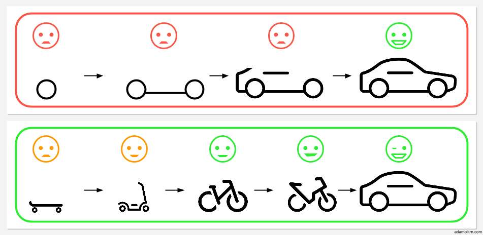

# Module I: Agile Basics & Software Product Lifecycle

## Table of Contents
- [Software Product Lifecycle](#software-product-lifecycle)
- [Traditional Software Development](#traditional-software-development)
- [Agile Software Development](#agile-software-development)
- [Agile Manifesto](#agile-manifesto)
- [Agile Frameworks](#agile-frameworks)
- [Lean Software Development](#lean-software-development)
- [Iterative & Incremental Development](#iterative--incremental-development)
- [Agile vs Waterfall](#agile-vs-waterfall)
- [Exam Preparation](#exam-preparation)

---

## Software Product Lifecycle

The **Software Product Lifecycle** describes the stages a software product goes through from conception to retirement.

### Key Stages

1. **Concept / Need Identification** – Recognizing a problem or requirement
2. **Requirements Gathering** – Understanding what the user wants
3. **Design** – Creating architecture, UI, system structure
4. **Development** – Writing and building the software
5. **Testing** – Ensuring the software works correctly
6. **Deployment** – Delivering/releasing the software to users
7. **Maintenance / Updates** – Fixing bugs, improving features
8. **Retirement** – End-of-life when the product is no longer useful

### Example: Instagram
New feature idea → Design → Develop → Release → Update regularly → Old features retired

---

## Traditional Software Development

Traditional methods focus on **planning everything upfront**.

### Waterfall Model

A **linear, step-by-step methodology** where each phase must finish before the next begins.

```
Requirements → Design → Development → Testing → Deployment → Maintenance
```

#### Advantages
- Simple and structured approach
- Works well for stable, clear requirements
- High predictability for scope, schedule, and budget
- Strong documentation helps with maintenance

#### Disadvantages ⚠️
- **Not flexible** – hard to accommodate requirement changes
- Late testing means issues found very late
- User feedback comes only after completion
- Changes during later phases are difficult and costly
- Less frequent client involvement during development

#### When to Use Waterfall
- Requirements are clear, fixed, and unlikely to change
- Well-known domain with low risk of change
- Strong documentation is required (regulatory systems, auditing)

> **Key Takeaway:** Waterfall is not suitable for fast-changing environments.

---

## Agile Software Development

Agile is a **flexible, iterative** approach where software is delivered **in small parts** and **improved continuously** with customer feedback.

### Key Characteristics
- Short development cycles called **iterations** or **sprints**
- Continuous user feedback
- Frequent releases
- Strong team collaboration
- Cross-functional, self-organizing teams
- Adaptability to change

### Core Philosophy
> *Deliver small working software quickly, improve based on feedback.*

### When to Use Agile
- Requirements are unclear or likely to change
- Dynamic environment (startups, web/mobile apps)
- Need to deliver value quickly and iterate based on real-user feedback
- Team can collaborate closely and adapt rapidly

---

## Agile Manifesto

The **Agile Manifesto** (created in 2001 by 17 software developers) expresses the core **values** of agile development.

### The 4 Core Values

<p align="center">
  
</p>

| Agile Values (Priority) | Over (Secondary Focus) |
|------------------------|------------------------|
| **Individuals and interactions** | Processes and tools |
| **Working software** | Comprehensive documentation |
| **Customer collaboration** | Contract negotiation |
| **Responding to change** | Following a fixed plan |

> **Note:** These values mean we prioritize the items on the left MORE than the items on the right. The items on the right still have value.

### Understanding Each Value

#### 1. Individuals and Interactions > Processes and Tools
- **Priority:** People, communication, collaboration, and problem-solving abilities
- **Rationale:** People can adapt, innovate, and solve unexpected problems in real-time
- **Secondary:** Processes and tools support the team but shouldn't control them

#### 2. Working Software > Comprehensive Documentation
- **Priority:** Delivering functional software as the primary measure of progress
- **Rationale:** Build in short cycles, gather feedback, improve continuously
- **Secondary:** Documentation is helpful but shouldn't delay development

#### 3. Customer Collaboration > Contract Negotiation
- **Priority:** Ongoing working relationship with customers as active collaborators
- **Rationale:** Show progress frequently, get feedback, adjust to evolving needs
- **Secondary:** Contracts set basic expectations but can't predict every detail

#### 4. Responding to Change > Following a Plan
- **Priority:** Embracing new requirements or feedback, even late in the project
- **Rationale:** Markets shift, new ideas emerge, assumptions change – adapt quickly
- **Secondary:** Plans are helpful roadmaps but should be dynamic, not unchangeable

> ✅ **Exam Alert:** This is one of the most repeated exam questions!

---

## Agile Frameworks

Agile is a mindset with multiple **frameworks** to implement it:

| Framework | Focus | Key Feature |
|-----------|-------|-------------|
| **Scrum** | Project management | Sprints, roles, ceremonies |
| **Kanban** | Workflow optimization | Visual board, WIP limits |
| **XP (Extreme Programming)** | High-quality code | Pair programming, TDD |

---

## Lean Software Development

Lean Software Development (LSD) originates from **Toyota manufacturing** principles and focuses on **optimizing efficiency and minimizing waste**.

### What is LSD?
An approach aimed at:
- **Preventing defects** through integrated quality assurance
- **Eliminating waste** by focusing on value-adding activities
- **Fast delivery** with reduced cycle times
- **Delaying decisions** until facts are available

### The 7 Lean Principles

<p align="center">
  
</p>

#### 1. Eliminate Waste
- **Focus:** Remove anything that doesn't add customer value
- **Examples:** Unnecessary code, long delays, unclear communication, extra work
- **Practice:** Regular meetings to identify issues and suggest improvements
- **Example:** Removing unused features, automating repetitive tasks

#### 2. Build Quality In
- **Focus:** Check quality from the beginning, not just at the end
- **Practice:** Test-Driven Development (TDD), automated testing
- **Benefit:** Identify and fix problems early, reduce rework
- **Example:** Run automated tests with every code change

#### 3. Amplify Learning
- **Focus:** Keep learning throughout the project
- **Practice:** Code reviews, meetings, pair programming, knowledge sharing
- **Benefit:** Knowledge distributed across the team
- **Example:** Two developers working together on a task

#### 4. Deliver Fast
- **Focus:** Build and release Minimum Viable Product (MVP) quickly
- **Practice:** Short cycles, early releases, gather feedback
- **Benefit:** Learn and improve faster
- **Example:** Launch simple app version, collect feedback, add features

#### 5. Empower the Team
- **Focus:** Trust and support self-organizing teams
- **Practice:** Respect, motivation, decision-making authority
- **Benefit:** Increased creativity and motivation
- **Example:** Team members make decisions about their own work

#### 6. Optimize the Whole
- **Focus:** View project holistically, not just individual tasks
- **Practice:** Break big problems into smaller parts, cross-functional collaboration
- **Benefit:** Better teamwork, unity, overall performance
- **Example:** Developers, testers, designers working together from the start

#### 7. Defer Commitment
- **Focus:** Wait for sufficient information before big decisions
- **Practice:** Flexible architecture, delay decisions until facts are clear
- **Benefit:** Avoid mistakes and wasted effort
- **Example:** Wait to choose database system until performance needs are known

> ⚠️ **Exam Alert:** "Explain any two Lean Software Development Principles" is a common 2-mark question.

---

## Iterative & Incremental Development

In Agile, **Iterative** and **Incremental** approaches work together for continuous improvement and faster delivery.

<p align="center">
  
</p>

### 🌀 Iterative Development

**Definition:** Project developed through **repeated cycles (iterations)**

**Process:** Each iteration involves planning, designing, coding, testing, and reviewing

**Goal:** **Refine and improve** the product step by step based on feedback

**Focus:** Improving the same part repeatedly until it's perfect

**Example:** Gmail Interface Evolution
- Started with basic email features (2004)
- Iterated by adding:
  - Conversation view (threaded emails)
  - Redesigned UI for better navigation
  - Dark mode, smart reply, AI suggestions
- Each version improved the core system based on user feedback

### 🧩 Incremental Development

**Definition:** Project built **piece by piece (in increments)**

**Process:** Each increment adds a **new functional feature**

**Goal:** Deliver **usable parts** early and expand functionality over time

**Focus:** Adding new features step by step until complete

**Example:** Spotify's Feature Evolution
1. Music playback and search
2. Playlist creation
3. Offline mode
4. Social sharing and collaborative playlists
5. Podcasts and video support

### Combined Approach in Agile

| Approach | What It Does | Example |
|----------|--------------|---------|
| **Iterative** | Improves existing parts repeatedly | Redesign login UI over 3 sprints |
| **Incremental** | Adds new parts step by step | Add login → profile → chat feature |
| **Combined (Agile)** | Build and improve features continuously | Deliver working app early, enhance every sprint |

> 🚀 **Key Insight:** Agile develops **incrementally** (adding features) and **iteratively** (refining them).

---

## Agile vs Waterfall

<p align="center">
  
</p>

### Side-by-Side Comparison

| Feature | Waterfall | Agile |
|---------|-----------|-------|
| **Process Structure** | Linear, phase-by-phase | Iterative, incremental cycles |
| **Requirements** | Fixed early, changes difficult | Evolving; change expected |
| **Customer Involvement** | Mostly at start and end | Continuous involvement |
| **Delivery** | Big release at the end | Frequent small releases |
| **Team Approach** | Hierarchical, specialized roles | Cross-functional, self-organizing |
| **Documentation** | Heavy documentation upfront | Lighter documentation, more working software |
| **Predictability** | High (when stable) | Lower (changes likely) |
| **Flexibility** | Poor – hard to accommodate changes | Very flexible – changes at many points |
| **Feedback** | Late feedback | Fast, continuous feedback |
| **Best For** | Stable requirements & predictable context | Dynamic contexts & evolving needs |

### When to Choose Which?

**Choose Waterfall when:**
- Requirements are clear, fixed, and stable
- Well-known domain with low change risk
- Strong documentation required (regulatory, safety)
- Predictable budget and timeline are critical

**Choose Agile when:**
- Requirements unclear or likely to change
- Dynamic environment (startups, web/mobile apps)
- Need quick value delivery with user feedback
- Team can collaborate closely and adapt rapidly

---

## Exam Preparation

### Quick Last-Minute Notes

- **Traditional:** Fixed plan, slow feedback
- **Agile:** Flexible, customer-focused, iterative
- **Agile Manifesto:** 4 core value pairs (must memorize)
- **Lean:** Eliminate waste + continuous improvement

### Expected Exam Questions

| Question | Marks |
|----------|-------|
| Explain Agile Manifesto values | 5 |
| Discuss Iterative & Incremental development | 2/5 |
| What is Lean Software Development? Explain any two principles | 2/5 |
| Compare Agile and Waterfall | 5 |
| Explain the Software Product Lifecycle | 5 |
| Advantages and disadvantages of Waterfall model | 5 |

### Key Topics to Focus On

1. ✅ **Agile Manifesto 4 Values** – Most repeated exam question
2. ✅ **Lean Principles** – Especially "any two principles" questions
3. ✅ **Waterfall Disadvantages** – Very important to understand
4. ✅ **Iterative vs Incremental** – Know the difference with examples
5. ✅ **Agile vs Waterfall Comparison** – Understand when to use each

---

## Additional Resources

For more comprehensive information on Agile practices:
- Visit the official [Agile Manifesto website](https://agilemanifesto.org/)
- Explore [Scrum.org](https://www.scrum.org/) for Scrum framework details
- Check [Lean Enterprise Institute](https://www.lean.org/) for Lean principles

