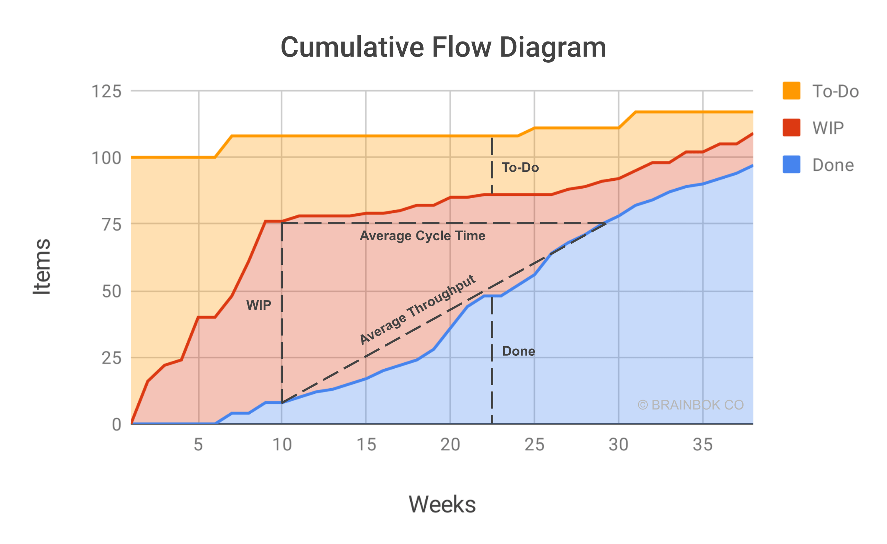
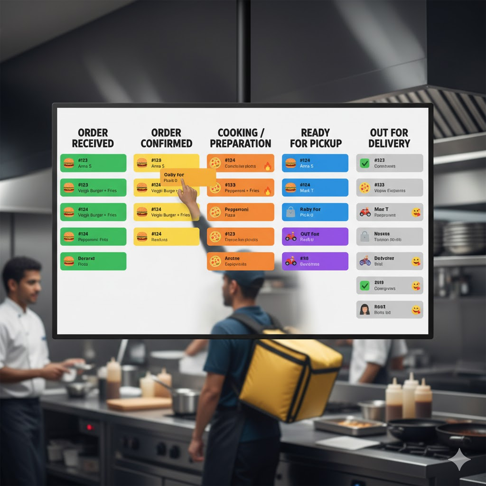
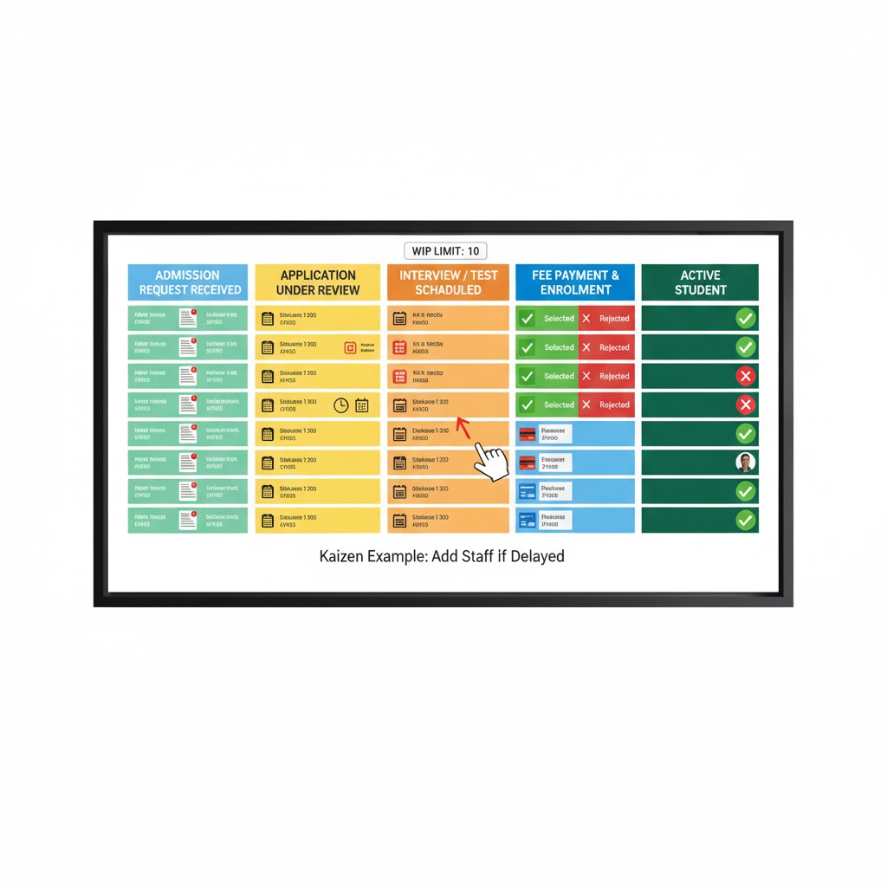
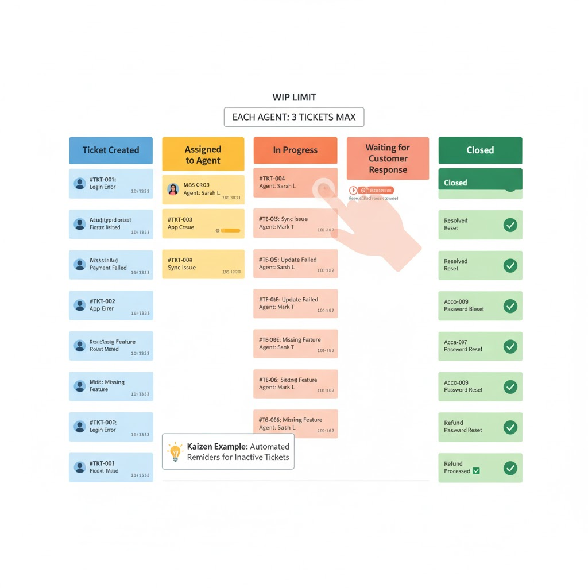

# Table of Contents
- [Module- 1](#module-i-agile-basics--software-product-lifecycle)
- [Module-2](#module-ii-kanban-principles--practices)


# Module I: Agile Basics & Software Product Lifecycle

## Table of Contents
- [Software Product Lifecycle](#software-product-lifecycle)
- [Traditional Software Development](#traditional-software-development)
- [Agile Software Development](#agile-software-development)
- [Agile Manifesto](#agile-manifesto)
- [Agile Frameworks](#agile-frameworks)
- [Lean Software Development](#lean-software-development)
- [Iterative & Incremental Development](#iterative--incremental-development)
- [Agile vs Waterfall](#agile-vs-waterfall)
- [Exam Preparation](#exam-preparation)

---

## Software Product Lifecycle

The **Software Product Lifecycle** describes the stages a software product goes through from conception to retirement.

### Key Stages

1. **Concept / Need Identification** – Recognizing a problem or requirement
2. **Requirements Gathering** – Understanding what the user wants
3. **Design** – Creating architecture, UI, system structure
4. **Development** – Writing and building the software
5. **Testing** – Ensuring the software works correctly
6. **Deployment** – Delivering/releasing the software to users
7. **Maintenance / Updates** – Fixing bugs, improving features
8. **Retirement** – End-of-life when the product is no longer useful

### Example: Instagram
New feature idea → Design → Develop → Release → Update regularly → Old features retired

---

## Traditional Software Development

Traditional methods focus on **planning everything upfront**.

### Waterfall Model

A **linear, step-by-step methodology** where each phase must finish before the next begins.

```
Requirements → Design → Development → Testing → Deployment → Maintenance
```

#### Advantages
- Simple and structured approach
- Works well for stable, clear requirements
- High predictability for scope, schedule, and budget
- Strong documentation helps with maintenance

#### Disadvantages ⚠️
- **Not flexible** – hard to accommodate requirement changes
- Late testing means issues found very late
- User feedback comes only after completion
- Changes during later phases are difficult and costly
- Less frequent client involvement during development

#### When to Use Waterfall
- Requirements are clear, fixed, and unlikely to change
- Well-known domain with low risk of change
- Strong documentation is required (regulatory systems, auditing)

> **Key Takeaway:** Waterfall is not suitable for fast-changing environments.

---

## Agile Software Development

Agile is a **flexible, iterative** approach where software is delivered **in small parts** and **improved continuously** with customer feedback.


### Key Characteristics
- Short development cycles called **iterations** or **sprints**
- Continuous user feedback
- Frequent releases
- Strong team collaboration
- Cross-functional, self-organizing teams
- Adaptability to change

### Core Philosophy
> *Deliver small working software quickly, improve based on feedback.*

### When to Use Agile
- Requirements are unclear or likely to change
- Dynamic environment (startups, web/mobile apps)
- Need to deliver value quickly and iterate based on real-user feedback
- Team can collaborate closely and adapt rapidly

---

## Agile Manifesto

The **Agile Manifesto** (created in 2001 by 17 software developers) expresses the core **values** of agile development.

### The 4 Core Values

<p align="center">
  
</p>

| Agile Values (Priority) | Over (Secondary Focus) |
|------------------------|------------------------|
| **Individuals and interactions** | Processes and tools |
| **Working software** | Comprehensive documentation |
| **Customer collaboration** | Contract negotiation |
| **Responding to change** | Following a fixed plan |

> **Note:** These values mean we prioritize the items on the left MORE than the items on the right. The items on the right still have value.

### Understanding Each Value

#### 1. Individuals and Interactions > Processes and Tools
- **Priority:** People, communication, collaboration, and problem-solving abilities
- **Rationale:** People can adapt, innovate, and solve unexpected problems in real-time
- **Secondary:** Processes and tools support the team but shouldn't control them

#### 2. Working Software > Comprehensive Documentation
- **Priority:** Delivering functional software as the primary measure of progress
- **Rationale:** Build in short cycles, gather feedback, improve continuously
- **Secondary:** Documentation is helpful but shouldn't delay development

#### 3. Customer Collaboration > Contract Negotiation
- **Priority:** Ongoing working relationship with customers as active collaborators
- **Rationale:** Show progress frequently, get feedback, adjust to evolving needs
- **Secondary:** Contracts set basic expectations but can't predict every detail

#### 4. Responding to Change > Following a Plan
- **Priority:** Embracing new requirements or feedback, even late in the project
- **Rationale:** Markets shift, new ideas emerge, assumptions change – adapt quickly
- **Secondary:** Plans are helpful roadmaps but should be dynamic, not unchangeable

> ✅ **Exam Alert:** This is one of the most repeated exam questions!

---

## Agile Frameworks

Agile is a mindset with multiple **frameworks** to implement it:

| Framework | Focus | Key Feature |
|-----------|-------|-------------|
| **Scrum** | Project management | Sprints, roles, ceremonies |
| **Kanban** | Workflow optimization | Visual board, WIP limits |
| **XP (Extreme Programming)** | High-quality code | Pair programming, TDD |

---

## Lean Software Development

Lean Software Development (LSD) originates from **Toyota manufacturing** principles and focuses on **optimizing efficiency and minimizing waste**.

### What is LSD?
An approach aimed at:
- **Preventing defects** through integrated quality assurance
- **Eliminating waste** by focusing on value-adding activities
- **Fast delivery** with reduced cycle times
- **Delaying decisions** until facts are available

### The 7 Lean Principles

<p align="center">
  
</p>

#### 1. Eliminate Waste
- **Focus:** Remove anything that doesn't add customer value
- **Examples:** Unnecessary code, long delays, unclear communication, extra work
- **Practice:** Regular meetings to identify issues and suggest improvements
- **Example:** Removing unused features, automating repetitive tasks

#### 2. Build Quality In
- **Focus:** Check quality from the beginning, not just at the end
- **Practice:** Test-Driven Development (TDD), automated testing
- **Benefit:** Identify and fix problems early, reduce rework
- **Example:** Run automated tests with every code change

#### 3. Amplify Learning
- **Focus:** Keep learning throughout the project
- **Practice:** Code reviews, meetings, pair programming, knowledge sharing
- **Benefit:** Knowledge distributed across the team
- **Example:** Two developers working together on a task

#### 4. Deliver Fast
- **Focus:** Build and release Minimum Viable Product (MVP) quickly
- **Practice:** Short cycles, early releases, gather feedback
- **Benefit:** Learn and improve faster
- **Example:** Launch simple app version, collect feedback, add features

#### 5. Empower the Team
- **Focus:** Trust and support self-organizing teams
- **Practice:** Respect, motivation, decision-making authority
- **Benefit:** Increased creativity and motivation
- **Example:** Team members make decisions about their own work

#### 6. Optimize the Whole
- **Focus:** View project holistically, not just individual tasks
- **Practice:** Break big problems into smaller parts, cross-functional collaboration
- **Benefit:** Better teamwork, unity, overall performance
- **Example:** Developers, testers, designers working together from the start

#### 7. Defer Commitment
- **Focus:** Wait for sufficient information before big decisions
- **Practice:** Flexible architecture, delay decisions until facts are clear
- **Benefit:** Avoid mistakes and wasted effort
- **Example:** Wait to choose database system until performance needs are known

> ⚠️ **Exam Alert:** "Explain any two Lean Software Development Principles" is a common 2-mark question.

---

## Iterative & Incremental Development

In Agile, **Iterative** and **Incremental** approaches work together for continuous improvement and faster delivery.

<p align="center">
  
</p>

### 🌀 Iterative Development

**Definition:** Project developed through **repeated cycles (iterations)**

**Process:** Each iteration involves planning, designing, coding, testing, and reviewing

**Goal:** **Refine and improve** the product step by step based on feedback

**Focus:** Improving the same part repeatedly until it's perfect

**Example:** Gmail Interface Evolution
- Started with basic email features (2004)
- Iterated by adding:
  - Conversation view (threaded emails)
  - Redesigned UI for better navigation
  - Dark mode, smart reply, AI suggestions
- Each version improved the core system based on user feedback

### 🧩 Incremental Development

**Definition:** Project built **piece by piece (in increments)**

**Process:** Each increment adds a **new functional feature**

**Goal:** Deliver **usable parts** early and expand functionality over time

**Focus:** Adding new features step by step until complete

**Example:** Spotify's Feature Evolution
1. Music playback and search
2. Playlist creation
3. Offline mode
4. Social sharing and collaborative playlists
5. Podcasts and video support

### Combined Approach in Agile

| Approach | What It Does | Example |
|----------|--------------|---------|
| **Iterative** | Improves existing parts repeatedly | Redesign login UI over 3 sprints |
| **Incremental** | Adds new parts step by step | Add login → profile → chat feature |
| **Combined (Agile)** | Build and improve features continuously | Deliver working app early, enhance every sprint |

> 🚀 **Key Insight:** Agile develops **incrementally** (adding features) and **iteratively** (refining them).

---

## Agile vs Waterfall

<p align="center">
  
</p>

### Side-by-Side Comparison

| Feature | Waterfall | Agile |
|---------|-----------|-------|
| **Process Structure** | Linear, phase-by-phase | Iterative, incremental cycles |
| **Requirements** | Fixed early, changes difficult | Evolving; change expected |
| **Customer Involvement** | Mostly at start and end | Continuous involvement |
| **Delivery** | Big release at the end | Frequent small releases |
| **Team Approach** | Hierarchical, specialized roles | Cross-functional, self-organizing |
| **Documentation** | Heavy documentation upfront | Lighter documentation, more working software |
| **Predictability** | High (when stable) | Lower (changes likely) |
| **Flexibility** | Poor – hard to accommodate changes | Very flexible – changes at many points |
| **Feedback** | Late feedback | Fast, continuous feedback |
| **Best For** | Stable requirements & predictable context | Dynamic contexts & evolving needs |

### When to Choose Which?

**Choose Waterfall when:**
- Requirements are clear, fixed, and stable
- Well-known domain with low change risk
- Strong documentation required (regulatory, safety)
- Predictable budget and timeline are critical

**Choose Agile when:**
- Requirements unclear or likely to change
- Dynamic environment (startups, web/mobile apps)
- Need quick value delivery with user feedback
- Team can collaborate closely and adapt rapidly

---

## Exam Preparation

### Quick Last-Minute Notes

- **Traditional:** Fixed plan, slow feedback
- **Agile:** Flexible, customer-focused, iterative
- **Agile Manifesto:** 4 core value pairs (must memorize)
- **Lean:** Eliminate waste + continuous improvement

### Expected Exam Questions

| Question | Marks |
|----------|-------|
| Explain Agile Manifesto values | 5 |
| Discuss Iterative & Incremental development | 2/5 |
| What is Lean Software Development? Explain any two principles | 2/5 |
| Compare Agile and Waterfall | 5 |
| Explain the Software Product Lifecycle | 5 |
| Advantages and disadvantages of Waterfall model | 5 |

### Key Topics to Focus On

1. ✅ **Agile Manifesto 4 Values** – Most repeated exam question
2. ✅ **Lean Principles** – Especially "any two principles" questions
3. ✅ **Waterfall Disadvantages** – Very important to understand
4. ✅ **Iterative vs Incremental** – Know the difference with examples
5. ✅ **Agile vs Waterfall Comparison** – Understand when to use each

---


# Module II: Kanban Principles & Practices

## Table of Contents
- [Introduction to Kanban](#introduction-to-kanban)
- [Kanban Board & Workflow](#kanban-board--workflow)
- [WIP Limits](#wip-limits-work-in-progress)
- [Lead Time vs Cycle Time](#lead-time-vs-cycle-time)
- [Cumulative Flow Diagram](#cumulative-flow-diagram-cfd)
- [Core Kanban Principles](#core-kanban-principles)
- [Continuous Improvement (Kaizen)](#continuous-improvement-kaizen)
- [Scrum vs Kanban](#scrum-vs-kanban)
- [Real-World Kanban Workflows](#real-world-kanban-workflows)
- [Key Concepts](#key-concepts)
- [Exam Preparation](#exam-preparation)

---

## Introduction to Kanban

### What is Kanban?

**Kanban** is an **Agile methodology** used to manage and improve workflow efficiently. It helps teams **visualize their work**, **limit tasks in progress**, and **focus on continuous delivery** rather than big releases.

> **Kanban = Visual + Continuous + Flow-based project management**

### Origin

Kanban was originally developed by **Toyota** in the 1940s for **manufacturing** to track car parts in production. Later, it was adapted for **software development** and **project management**.

### Core Philosophy

Kanban enables teams to:
- **Visualize work** through boards
- **Limit work in progress** to prevent overload
- **Manage flow** continuously
- **Focus on delivery** without strict iterations

---

## Kanban Board & Workflow

<p align="center">
  
</p>

### The Kanban Board

At the heart of Kanban is the **Kanban Board**, which visually represents the progress of work. It's divided into columns representing workflow stages.

#### Basic Board Structure

| To Do | In Progress | Testing | Done |
|:------|:------------|:--------|:-----|
| Tasks yet to start | Tasks being worked on | Tasks under review | Completed tasks |

Each task is represented by a **card** (physical sticky note or digital card like in Trello/Jira).

### How Kanban Works

#### 1. Visualize Work
Every task is placed on a Kanban board as a card.

**Example:** "Design homepage," "Fix login bug," "Write API documentation"

#### 2. Limit Work in Progress (WIP)
Set a limit for how many tasks can be in progress at once.

**Example:** "Only 3 tasks can be 'In Progress' at a time"

This prevents overloading and ensures focus.

#### 3. Manage Flow
As tasks move from left to right (To Do → In Progress → Done), the team tracks progress and removes bottlenecks.

**Example:** If "Testing" always has many stuck tasks, the issue might be with QA capacity.

#### 4. Make Process Policies Explicit
The team agrees on clear rules.

**Example:** "A task can move to 'Testing' only after code review"

#### 5. Implement Feedback Loops
Daily stand-ups or review meetings are used to discuss issues and improve flow.

#### 6. Continuous Improvement (Kaizen)
The team regularly reviews the board and process to improve efficiency and delivery speed.

### Simple Software Team Example

Imagine a small app development team working on a weather app:

| To Do | In Progress | Testing | Done |
|-------|-------------|---------|------|
| Create login screen | Build API for weather data | Fix search bar bug | Set up project repo |
| Add location feature | Design UI for forecast screen | | |

**Workflow:**
- When "Build API for weather data" is done, it moves to "Testing"
- "Design UI for forecast screen" can't start until there's a free slot in "In Progress" (WIP limit = 2)
- Once testing is passed, tasks go to "Done"

This keeps the workflow smooth and balanced.

### Popular Kanban Tools

- **Trello**
- **Jira**
- **Asana** (with Kanban view)
- **GitHub Projects**

### Advantages of Kanban

- ✅ Simple and visual — easy to understand
- ✅ Flexible — no strict roles or sprints
- ✅ Great for continuous delivery projects
- ✅ Encourages teamwork and transparency
- ✅ Immediate feedback on bottlenecks

### Limitations

- ⚠️ Hard to predict timelines (since it's flow-based)
- ⚠️ Needs disciplined team members to update cards regularly
- ⚠️ Can be too flexible for teams needing structure

### Quick Summary

| Aspect | Kanban Summary |
|--------|----------------|
| **Focus** | Continuous delivery and workflow management |
| **Board** | Visual tool with columns for stages |
| **Planning** | No fixed iterations (unlike Scrum) |
| **Flexibility** | Very high |
| **Best For** | Support, DevOps, or teams with frequent changes |

---

## WIP Limits (Work In Progress)

### Definition

**WIP** stands for **Work In Progress**. A **WIP Limit** means setting a **maximum number of tasks** that can be worked on **at the same time** in any column on your Kanban board.

> 👉 It controls how much work is being handled simultaneously.

### Purpose

The main goals of WIP limits are:

1. **Prevent overload** – Ensures team members aren't juggling too many tasks at once
2. **Improve focus** – People finish what they start instead of switching tasks
3. **Identify bottlenecks** – If a column always hits its limit, that's where work is slowing down
4. **Maintain steady flow** – Tasks move smoothly from start to finish

> 💡 **Key Insight:** Do less at a time → Finish faster overall

### Example

Let's say your Kanban board looks like this:

| To Do | In Progress (Limit = 2) | Testing (Limit = 1) | Done |
|-------|-------------------------|---------------------|------|
| Task 1 | Task 3 | Task 5 | Task 2 |
| Task 4 | Task 6 | | |

Here:
- The **"In Progress"** column has a **WIP Limit of 2**
- Only **2 tasks** can be actively worked on at once
- Before starting a new task, one of the current tasks must move forward (to Testing or Done)

This avoids starting too many tasks and helps focus on completing existing ones.

### Real-Life Analogy: Cooking

Imagine cooking:
- If you try to cook **five dishes at once**, you'll burn something 🔥
- But if you cook **two at a time**, you finish all faster and better

That's exactly what **WIP limits** do in Kanban.

### Summary

| Term | Meaning |
|------|---------|
| **Definition** | A maximum number of tasks allowed in any stage at one time |
| **Purpose** | To reduce multitasking, find bottlenecks, and keep workflow smooth |
| **Example** | "In Progress" column has a WIP limit of 3 — can't start a 4th task until one finishes |

---

## Lead Time vs Cycle Time

### Definitions

| Term | Definition |
|------|------------|
| **Lead Time** | The **total time** taken from the moment a task is **requested** (added to "To Do") until it is **completed** ("Done") |
| **Cycle Time** | The **actual working time** — the time taken from when work on a task **starts** ("In Progress") until it is **completed** ("Done") |

### Simple Explanation

- **Lead Time** = Waiting time **+** Working time
- **Cycle Time** = Only the **Working time**

### Example: Building a Login Page

Let's say:
- You add task "Build Login Page" to **To Do** list on **1st Nov**
- Work on it starts on **4th Nov**
- The task is completed on **8th Nov**

| Term | Calculation | Result |
|------|-------------|--------|
| **Lead Time** | From 1st Nov (requested) → 8th Nov (completed) | **7 days** |
| **Cycle Time** | From 4th Nov (started) → 8th Nov (completed) | **4 days** |

### Purpose

| Term | Purpose |
|------|---------|
| **Lead Time** | Measures how long a customer or manager waits for a request to be delivered |
| **Cycle Time** | Measures team efficiency — how fast the team completes a task once they start it |

### Real-Life Analogy: Pizza Delivery 🍕

Imagine you order a pizza:
- You place the order at **6:00 PM**
- The chef starts cooking at **6:15 PM**
- Pizza arrives at **6:45 PM**

| Term | Meaning | Time |
|------|---------|------|
| **Lead Time** | From when you ordered (6:00) to when you got it (6:45) | **45 minutes** |
| **Cycle Time** | From when cooking started (6:15) to when it was delivered (6:45) | **30 minutes** |

### Formula Summary

| Term | Formula |
|------|---------|
| **Lead Time** | Task Completion Date − Task Creation Date |
| **Cycle Time** | Task Completion Date − Work Start Date |

### Key Takeaway

> - **Lead Time** = Total waiting + working time
> - **Cycle Time** = Only working time after task starts

---

## Cumulative Flow Diagram (CFD)

<p align="center">
  
</p>

### What is a CFD?

A **Cumulative Flow Diagram (CFD)** is a **visual chart** used in **Kanban** and **Agile** to show how tasks are moving through different stages over time.

It helps teams **see the overall flow of work** and easily **spot bottlenecks or delays**.

### How It Looks

It's usually a **stacked area chart** like this:

```
↑ Number of Tasks
│
│       ▓▓▓▓▓▓▓▓▓▓▓▓▓  ← Done
│     ▓▓▓▓▓▓▓▓▓▓▓▓▓▓▓  ← Testing
│   ▓▓▓▓▓▓▓▓▓▓▓▓▓▓▓▓▓  ← In Progress
│ ▓▓▓▓▓▓▓▓▓▓▓▓▓▓▓▓▓▓▓  ← To Do
│________________________________→ Time
```

Each colored band represents the number of tasks in that stage over time.

### How It Works

- The **X-axis** shows **time** (days, weeks, etc.)
- The **Y-axis** shows the **number of tasks**
- Each **colored layer** represents a **workflow stage** (To Do, In Progress, Done)
- As time passes, the colored areas grow — showing how tasks are added and completed

### Identifying Bottlenecks with CFD

| Observation in CFD | What It Means |
|-------------------|---------------|
| A band (e.g., "In Progress") keeps **getting wider** | Work is stuck there → **bottleneck** |
| Bands are **parallel and stable** | Work is flowing smoothly |
| "Done" band is **flat** | Team isn't finishing tasks regularly |
| Large **gap between To Do and Done** | Too much work in progress; team is overloaded |

### Example Scenario

If your CFD shows:
- "To Do" area is getting **wider** → Tasks are piling up, not starting
- "In Progress" area is **growing faster than others** → Too many tasks started, not finished
- "Done" area is **steady or flat** → Work isn't getting completed quickly

That means there's a **bottleneck** in your process.

### Purpose of CFD

1. **Visualize workflow health** – See how tasks move through each stage
2. **Spot bottlenecks** – Find where tasks are getting delayed
3. **Measure stability** – Consistent, parallel bands mean a steady flow
4. **Predict delivery** – Helps estimate when future work will be done based on flow trends

### Simple Example

Suppose:
- On Monday → 5 tasks in *To Do*
- Wednesday → 8 tasks in *In Progress*
- Friday → 10 tasks in *Done*

If "In Progress" grows faster than "Done," your team is **starting too much** but **finishing too little** — a **bottleneck** in active work.

### Summary

| Term | Explanation |
|------|-------------|
| **Cumulative Flow Diagram (CFD)** | A stacked area chart showing how many tasks are in each workflow stage over time |
| **Use** | Tracks work progress and finds delays |
| **Bottleneck Sign** | A widening area for one stage means work is getting stuck there |

> 💡 **Key Takeaway:** A **CFD** helps you **see where work slows down** — so you can fix the bottlenecks and keep your workflow smooth.

---

## Core Kanban Principles

### The Four Main Principles

#### 1. Start with the Existing Process

**Meaning:** Don't throw away your current system or workflow. Begin from what you already have and improve it step by step.

**Why:** It saves time, avoids confusion, and helps people adapt easily.

**Example:** A software team already uses Trello to manage tasks. Instead of switching to a new tool, they start applying Kanban principles to the same Trello board — just add WIP limits and track flow.

#### 2. Agree to Pursue Incremental and Evolutionary Change

**Meaning:** Make **small, continuous improvements** instead of large, sudden changes.

**Why:** Small changes are easier to test, manage, and accept by the team.

**Example:** Instead of redesigning the entire workflow, the team decides to first reduce the number of "In Progress" tasks from 6 to 4 and see if speed improves.

#### 3. Respect the Current Roles, Responsibilities & Titles

**Meaning:** Don't immediately change job titles or team structure. Keep people's roles the same while improving how they work together.

**Why:** This avoids conflict and resistance among team members.

**Example:** The QA tester remains a tester, the developer remains a developer — but now they collaborate through the Kanban board instead of waiting for handovers.

#### 4. Encourage Leadership at All Levels

**Meaning:** Anyone — regardless of rank — can contribute ideas to improve the workflow.

**Why:** Promotes creativity, motivation, and shared ownership.

**Example:** A junior developer suggests using automation for testing to save time — the team accepts the idea and implements it.

### Principles Summary

| Principle | What It Means | Example |
|-----------|---------------|---------|
| **Start with the existing process** | Use your current system and improve from there | Begin Kanban on your existing Trello board |
| **Incremental and evolutionary change** | Make small, continuous improvements | Reduce WIP gradually |
| **Respect current roles & titles** | Don't force role changes | Keep team roles the same while improving process |
| **Leadership at all levels** | Everyone can contribute ideas | Junior member's idea gets implemented |

> ✅ **Summary:** Kanban is not about replacing systems — it's about improving them gradually, respecting people, and encouraging everyone to lead through ideas.

---

## Continuous Improvement (Kaizen)

### Meaning

**Kaizen** is a Japanese term that means **"change for better"** — or simply, **continuous improvement**.

In Kanban, it means the team is always looking for small ways to make their process faster, smoother, and more efficient.

### How It Works in Kanban

Kanban is not about making one big change — it's about **making small, continuous improvements** based on data and feedback.

Teams use their **Kanban board** and **metrics** (like lead time, cycle time, and cumulative flow diagrams) to spot where work is slowing down — and then improve those areas.

### Steps of Continuous Improvement

1. **Observe the current workflow** – Look at the Kanban board and see how tasks are moving
2. **Identify bottlenecks or problems** – For example, tasks pile up in the "Testing" column
3. **Discuss as a team** – Talk about why it's happening and how to fix it
4. **Implement a small change** – Maybe add an extra tester or limit new tasks until old ones are done
5. **Review the results** – Check if the change helped; if yes, keep it; if not, try another idea

### Example

A mobile app team notices that tasks often stay too long in "Code Review."

They:
- Add a WIP limit of **2** for "Code Review"
- Hold a daily short meeting to review blocked tasks

After a week, the flow becomes smoother — this is **Kaizen in action**.

### Why Kaizen Matters

| Benefit | Description |
|---------|-------------|
| **Improves efficiency** | Small improvements remove waste over time |
| **Reduces risk** | Changes are gradual — less chance of failure |
| **Boosts morale** | Everyone contributes ideas for improvement |
| **Adapts to change** | Teams stay flexible and ready for new challenges |

### Key Takeaway

> **Kaizen in Kanban = Small, ongoing improvements made by everyone to enhance workflow efficiency and quality.**

---

## Scrum vs Kanban

<p align="center">
  
</p>

### Detailed Comparison

| **Aspect** | **Scrum** | **Kanban** |
|------------|-----------|------------|
| **Definition** | A framework for managing work in **fixed-length iterations (Sprints)** | A **visual flow-based** method for managing continuous work |
| **Approach** | **Iterative** — work is done in short cycles (usually 2–4 weeks) | **Continuous flow** — work items move through stages without fixed timeboxes |
| **Roles** | Has **defined roles** – Scrum Master, Product Owner, and Development Team | No specific roles are defined; team members share responsibilities |
| **Planning** | Work is planned at the start of each sprint | Work is planned continuously as capacity becomes available |
| **Work In Progress (WIP)** | WIP is controlled **per sprint** (fixed amount of work) | WIP is controlled **per workflow stage** (set limits on columns) |
| **Meetings** | Requires fixed meetings – Daily Standup, Sprint Planning, Sprint Review, Retrospective | Meetings are **not mandatory**, but feedback loops are encouraged |
| **Change during execution** | Changes are **not allowed** within a sprint | Changes can be made anytime as workflow is flexible |
| **Measurement Metrics** | Measured by **Velocity** (how many story points per sprint) | Measured by **Lead Time, Cycle Time, and Flow Efficiency** |
| **Board Structure** | Scrum Board resets after each sprint | Kanban Board is continuous and never resets |
| **Best suited for** | Teams that prefer **structured, time-bound development** | Teams that prefer **flexible, continuous delivery** |
| **Example** | Developing a new mobile app feature over a 2-week sprint | Continuously fixing bugs and improving an existing app |

### Simple Way to Remember

> - 🕓 **Scrum = Sprints (time-boxed cycles)**
> - 🔄 **Kanban = Continuous flow (no time-box)**

### Example Scenario

- A **Scrum team** working on a new e-commerce feature will plan tasks for a 2-week sprint and commit to finishing them before moving to the next sprint.
- A **Kanban team** managing customer support tickets will continuously pick up new tickets as they become free — no sprint boundaries.

### Key Takeaway

> **Scrum** gives structure and time-based goals.  
> **Kanban** gives flexibility and visual control over workflow.

---

## Real-World Kanban Workflows

### 1. Food Delivery System 🍔

<p align="center">
  
</p>

#### Workflow Stages

| Stage | Description |
|-------|-------------|
| **Order Received** | Customer places an order via app/website |
| **Order Confirmed** | Restaurant accepts and starts preparing |
| **Cooking / Preparation** | Chef prepares the food |
| **Ready for Pickup** | Food packed and waiting for delivery partner |
| **Out for Delivery** | Delivery partner is on the way |
| **Delivered** | Customer receives food, order completed |

#### Example Flow

```
[ Order Received ] → [ Confirmed ] → [ Cooking ] → [ Ready for Pickup ] → [ Out for Delivery ] → [ Delivered ✅ ]
```

**WIP Limit Example:**
- Cooking: Max 5 orders at a time (to maintain quality and speed)

**Kaizen Example:**
- If "Ready for Pickup" gets crowded, they might add more delivery partners

---

### 2. Student Management System 🎓

<p align="center">
  
</p>

#### Workflow Stages

| Stage | Description |
|-------|-------------|
| **Admission Request Received** | Student applies for admission |
| **Application Under Review** | Admin verifies documents |
| **Interview / Test Scheduled** | Student is called for evaluation |
| **Selected / Rejected** | Decision is made |
| **Fee Payment & Enrollment** | Student pays fees and gets enrolled |
| **Active Student** | Student officially part of the institution |

#### Example Flow

```
[ Request Received ] → [ Under Review ] → [ Test Scheduled ] → [ Selected ] → [ Fee Paid ] → [ Active Student ✅ ]
```

**WIP Limit Example:**
- Only 10 applications can be "Under Review" at once to avoid overload

**Kaizen Example:**
- If "Under Review" keeps getting delayed, the team may add one more staff member for verification

---

### 3. Customer Support System 💬

<p align="center">
  
</p>

#### Workflow Stages

| Stage | Description |
|-------|-------------|
| **Ticket Created** | User submits issue |
| **Assigned to Agent** | Ticket given to a support agent |
| **In Progress** | Agent working on the issue |
| **Waiting for Customer Response** | Agent needs more info |
| **Resolved** | Problem fixed |
| **Closed** | Customer confirms issue is solved |

#### Example Flow

```
[ Ticket Created ] → [ Assigned ] → [ In Progress ] → [ Waiting for Response ] → [ Resolved ] → [ Closed ✅ ]
```

**WIP Limit Example:**
- Each support agent handles maximum 3 active tickets at a time

**Kaizen Example:**
- If tickets get stuck in "Waiting for Customer," they might introduce automated reminders

---

### Key Features in All Kanban Workflows

| Concept | Description |
|---------|-------------|
| **Columns** | Represent workflow stages |
| **Cards** | Represent tasks/orders/tickets |
| **WIP Limits** | Restrict number of items in each stage |
| **Flow** | Items move from left (start) to right (done) |
| **Goal** | Ensure smooth, continuous progress with minimal delay |

---

## Key Concepts

### Pull System vs Push System

| **Aspect** | **Push System** | **Pull System (Kanban)** |
|------------|-----------------|--------------------------|
| **Definition** | Work is assigned or "pushed" to the next stage, regardless of capacity | Work is "pulled" by the next stage only when it has capacity to handle it |
| **Who decides when to start?** | The **previous stage** pushes work forward | The **next stage** pulls work when ready |
| **Flow control** | Based on **schedule or plan** | Based on **demand or capacity** |
| **Risk** | Can create **overload** or **bottlenecks** if next stage is busy | Avoids overload — each stage controls its own workload |
| **Example (Food Delivery)** | Restaurant keeps cooking even if delivery agents are busy — orders pile up | Restaurant starts cooking only when a delivery partner is available |
| **Example (Student Management)** | Admin keeps approving admissions even if classes are full | Admin allows new admissions only when seats are available |
| **Example (Customer Support)** | System assigns tickets automatically even if agents are overloaded | Agents pull a new ticket only after finishing current one |
| **Efficiency** | Lower efficiency due to waiting and backlog | Higher efficiency and smooth flow |
| **Used in** | Traditional project management, manufacturing | Kanban, Lean, Just-in-Time systems |

#### Simple Way to Remember

- 🧱 **Push System:** "I'll give you work whether you're ready or not"
- 🧲 **Pull System:** "I'll take work only when I'm ready for it"

#### Real-Life Analogy: Restaurant Kitchen

- **Push System:** The chef keeps making dishes even when waiters haven't served old ones — soon the counter is full
- **Pull System:** The chef cooks only when a waiter takes a new order — no pile-up, food stays fresh

> ✅ **Key Takeaway:** Kanban follows a Pull System — every team member pulls new work only when they have finished their current task. This ensures smooth workflow, no overload, and faster delivery.

---

### Throughput

#### What is Throughput?

**Throughput** means the **number of tasks completed** in a given period of time. It tells you **how much work your team finishes**, not how fast individual tasks move.

> **Throughput = Total number of work items finished per unit of time**

#### Examples

**Example 1 – Customer Support:**  
If your team **closes 25 tickets in one week**, then your **throughput = 25 tickets/week**

**Example 2 – Food Delivery:**  
If a restaurant delivers **120 orders in one day**, then **throughput = 120 orders/day**

**Example 3 – Student Management System:**  
If the admission team approves **30 student applications in 5 days**, then **throughput = 6 applications/day**

#### Why Throughput Matters

| Purpose | Explanation |
|---------|-------------|
| **Measures productivity** | Shows how much work is completed over time |
| **Helps forecasting** | Teams can estimate how much work they can finish in the next week or sprint |
| **Tracks improvement** | If throughput increases, your process is becoming more efficient |
| **Identifies bottlenecks** | Sudden drops in throughput mean some stage is slowing down |

#### Throughput vs Cycle Time

| Concept | What It Measures | Example |
|---------|------------------|---------|
| **Throughput** | How many tasks completed per time | 20 tasks/week |
| **Cycle Time** | How long one task takes to finish | 2 days/task |

#### Key Takeaway

> 🧩 **Throughput = Quantity of work done**  
> ⏱️ **Cycle Time = Time taken per work item**

---

## Exam Preparation

### High-Priority Questions (10 or 5 marks)

| No. | Question | Marks | Why Important |
|-----|----------|-------|---------------|
| 1 | **Explain the Kanban board with a neat diagram. Describe the workflow.** | 5/10 | **Repeated every year** — draw 3-column board for full marks |
| 2 | **What are WIP limits? Explain their importance in Kanban.** | 2/5 | Short + Long repeated question. Easy scoring |
| 3 | **Differentiate between Lead Time and Cycle Time with examples.** | 2/5 | Very frequently asked |
| 4 | **Explain Cumulative Flow Diagram (CFD) and how it helps in identifying bottlenecks.** | 5 | High scoring question |
| 5 | **Explain the principles of Kanban.** | 5 | Direct theory question, often asked |
| 6 | **Discuss 'Continuous Improvement (Kaizen)' in Kanban.** | 5 | Common conceptual question |
| 7 | **Compare Scrum and Kanban.** | 5 | Frequently asked in Part B |
| 8 | **Illustrate a Kanban workflow model for a support/food delivery/student management system.** | 10 | **Case-based question** — Can come in Part C |

### Short Notes (2 Marks)

- Define Kanban
- Pull system vs Push system
- Kaizen
- Throughput
- WIP limits
- Cycle Time vs Lead Time

### Key Focus Areas

1. ✅ **Kanban Board Diagram** – Must be able to draw with workflow description
2. ✅ **WIP Limits** – Definition, purpose, and example
3. ✅ **Lead Time vs Cycle Time** – Clear differentiation with examples
4. ✅ **Cumulative Flow Diagram** – Understanding bottleneck identification
5. ✅ **Four Core Principles** – Start with existing, incremental change, respect roles, encourage leadership
6. ✅ **Kaizen (Continuous Improvement)** – Concept and implementation
7. ✅ **Scrum vs Kanban** – Major differences in table format
8. ✅ **Real-world Case Studies** – Be ready to design Kanban workflow for any system

### Quick Last-Minute Notes

- **Kanban** = Visual workflow management with continuous delivery
- **WIP Limits** = Control work in progress to maintain flow
- **Pull System** = Work is pulled when ready, not pushed
- **Lead Time** = Request to completion (includes waiting)
- **Cycle Time** = Start to completion (only working time)
- **CFD** = Visual chart to spot bottlenecks
- **Kaizen** = Continuous small improvements
- **Throughput** = Tasks completed per time period

### Study Tips

1. **Practice drawing** Kanban boards with proper columns and WIP limits
2. **Memorize** the 4 core Kanban principles
3. **Understand** the difference between Lead Time and Cycle Time with real examples
4. **Be ready** to design a Kanban workflow for any given scenario (food delivery, student management, etc.)
5. **Know** how to read and interpret a Cumulative Flow Diagram

---

# MODULE   3 


----
### 🧩 Requirements in Agile

Requirements describe what the customer wants the system to do.

In traditional models (like Waterfall), requirements are long, detailed documents.

In Agile, they are written in a simple, flexible way — so teams can easily adapt to changes.

---

### 💬 User Stories

A User Story is a short, simple statement that describes a feature from the user’s perspective.

It focuses on who wants it, what they want, and why they want it.

### 🎯 Purpose of User Stories

👉 Keeps focus on user needs, not just technical details.

👉 Encourages conversation between the team and stakeholders.

👉 Helps in planning and estimating work easily.

👉 Allows quick adjustments when requirements change.

---

### 🚀 1. Release Planning

Definition:
Release planning is deciding which features will be included in the next release (version) of the product and when it will be delivered.

Purpose:
It gives a big-picture view of what the team will deliver over several iterations.

Example:

👉 Version 1.0 → Login, Registration, Profile

👉 Version 2.0 → Chat, Notifications

✅ Goal: To plan the overall timeline and scope of multiple iterations that together form a product release.

---

### 🔄 2. Iteration Planning (Sprint Planning)

Definition:
It is the detailed planning done before each iteration (or sprint).
The team decides which user stories to complete in that short period (usually 1–4 weeks).

Purpose:
👉 To break down the release plan into smaller tasks that can be finished within one iteration.

Example:

Sprint 1 → Build Login page

Sprint 2 → Build Registration and Profile page

✅ Goal: To set clear short-term goals for the team during each sprint.

---

### 🧪 3. Customer Tests

Definition:
Customer tests are also called Acceptance Tests.
They are written by or with the customer to describe what the software should do to be accepted as “done.”

Purpose:
To make sure the product meets real user expectations and works correctly.

Example:
For the user story “As a user, I want to reset my password”,
customer test could be:

👉 The user receives a reset link in email.

👉 The new password works immediately after reset.

✅ Goal: To confirm that every feature works as the customer expects.

---

### 🧱 4. Small and Regular Releases

Definition:
Instead of one big release at the end, Agile teams deliver small pieces of working software frequently (e.g., every few weeks).

Purpose:
👉 To get early feedback from users and make improvements quickly.

Example:

Week 2: Login feature released

Week 4: Profile feature released

Week 6: Messaging feature released

✅ Goal: To provide value to users early and often, not wait until the whole project is done.


---


### 👩‍💻👨‍💻 5. Pair Programming

Definition:
Pair Programming is when two developers work together on one computer to write code.

One is the Driver – types the code.

The other is the Observer/Navigator – reviews the code, suggests ideas, and checks for errors.

Purpose:

👉 Improves code quality (because two people are checking it).

👉 Encourages knowledge sharing between team members.

👉 Reduces mistakes and improves design ideas.

Example:
One developer writes the login code while the other ensures security checks are correctly handled.

✅ Goal: To produce better code through teamwork and shared learning.


---


### ⚙️ 6. Continuous Integration (CI)

Definition:
Continuous Integration means developers frequently (often daily) merge their code changes into a shared central repository (like GitHub).
After each merge, automated tests run to check if the new code works well with the old code.

Purpose:

👉 To detect bugs early.

👉 To keep the project working at all times.

👉 To avoid “integration problems” where different parts of the code don’t fit together.

Example:
A developer adds a new “Profile” feature → commits it → automated tests check that Login and Dashboard still work.

✅ Goal: Ensure the software always stays stable and up-to-date.

----

### 👥 7. Collective Code Ownership

Definition:
In Agile, everyone on the team can edit any part of the code — no one “owns” one specific file or module.

Purpose:

👉 Encourages team responsibility — everyone ensures code quality.

👉 Increases flexibility — anyone can fix bugs or add features anywhere.

👉 Prevents delays if one developer is absent.

Example:
If Developer A finds a bug in code written by Developer B, they can fix it directly instead of waiting for B.

✅ Goal: To build teamwork and shared responsibility for the entire project.

----

### 8. 👥 Team Roles in Agile

In Agile (especially Scrum), the project team is self-organized — everyone works together to deliver a working product.
There are three main roles in an Agile team:

🧑‍💼 1. Product Owner (PO)

👉 Represents the customer or business side.

👉 Responsible for deciding what needs to be built.

👉 Maintains the Product Backlog — a list of all features, improvements, and fixes.

👉 Sets priorities (what to do first) based on customer needs and business value.

👉 Works closely with the team to explain user stories and requirements.

Example:
The Product Owner decides that the “Search Feature” should be developed before the “Dark Mode Feature.”

✅ Goal: Make sure the team builds the right product that meets customer expectations.

🧑‍🏫 2. Scrum Master

👉 Acts as a coach and facilitator for the team.

👉 Ensures the team follows Agile and Scrum principles.

👉 Removes any obstacles or blockers that slow down progress.

👉 Helps the team improve continuously through meetings like Daily Stand-ups and Retrospectives.

👉 Protects the team from unnecessary pressure or outside distractions.

Example:
If the team is waiting for access to a testing server, the Scrum Master arranges it quickly.

✅ Goal: Help the team work smoothly and efficiently.

👩‍💻 3. Development Team

👉 A group of professionals who build the product — includes developers, testers, designers, etc.

👉 They decide how to complete the work during each iteration (sprint).

👉 Work together collaboratively (no boss-subordinate structure inside the team).

👉 Responsible for coding, testing, integrating, and delivering working software.

Example:
Developers code the login feature, testers check it, and designers improve its look.

✅ Goal: Deliver high-quality working software in every sprint.


🧩 4. Optional (Supporting Role): “Stakeholder”

👉 Anyone affected by the project — customers, users, managers, investors, etc. They give requirements, feedback, and review progress.

---
## 🌟 Agile Principles

The **Agile Manifesto** is built on **4 values** and **12 principles** that guide how Agile teams work.  
These principles focus on **flexibility, teamwork, customer satisfaction**, and **delivering quality software**.


### 🧭 The 12 Principles of Agile (Explained Simply)

| No. | Principle | Simple Meaning / Example |
| --- | ---------- | ------------------------ |
| **1** | Customer satisfaction through early and continuous delivery of software. | Deliver working software regularly so customers see progress early. |
| **2** | Welcome changing requirements, even late in development. | Be flexible — if the customer wants changes, adapt quickly. |
| **3** | Deliver working software frequently. | Release small, working parts often (every 1–4 weeks). |
| **4** | Business people and developers must work together daily. | Continuous communication between customer and team. |
| **5** | Build projects around motivated individuals. | Trust your team — give them the support they need. |
| **6** | Face-to-face communication is the best way to convey information. | Talk directly (in person or via meetings) for clarity. |
| **7** | Working software is the main measure of progress. | The focus is on what works, not on documents or plans. |
| **8** | Sustainable development — maintain a constant pace indefinitely. | Avoid overwork; keep a steady, healthy speed. |
| **9** | Continuous attention to technical excellence and good design. | Write clean, quality code and keep improving it. |
| **10** | Simplicity — maximize the amount of work not done. | Focus only on what’s needed; don’t overcomplicate. |
| **11** | Best results come from self-organizing teams. | Teams manage their own work — no micromanagement. |
| **12** | Regular reflection and adjustment. | After each sprint, the team reviews what went well and what to improve. |


✅ **In short:** Agile principles help teams **deliver value faster**, **adapt to change**, and **continuously improve** through teamwork and communication.

---

## MODULE 4

---
### 🌀 What is Scrum?


Scrum is an Agile framework used to manage and complete complex projects — especially software development.

It helps teams work together, deliver work in short cycles, and adapt quickly to changes.

Scrum is based on teamwork, transparency, and continuous improvement

---

# 🌟 Benefits of Agile Methodology

Agile offers many advantages to both teams and customers.  
It focuses on **flexibility, collaboration, and continuous improvement** to ensure better software delivery and customer satisfaction.

---

### 🚀 Key Benefits of Agile


| **Benefit**                   | **Explanation**                                                              |
| ----------------------------- | ---------------------------------------------------------------------------- |
| **1. Flexibility**            | Easy to change plans when customer needs change.                             |
| **2. Faster Delivery**        | Software is delivered in small parts (sprints), so users get results early.  |
| **3. Better Quality**         | Continuous testing and feedback improve product quality.                     |
| **4. Team Collaboration**     | Daily meetings and open communication increase teamwork.                     |
| **5. Customer Satisfaction**  | Customers see progress regularly and can give feedback.                      |
| **6. Transparency**           | Everyone knows what’s happening through regular meetings and visible boards. |
| **7. Continuous Improvement** | Teams review their performance after every sprint and improve.               |

---
## 🧩 Scrum Framework

The Scrum Framework is made up of three main parts:

### 1. Scrum Roles

| **Role**                   | **Responsibility**                                        |
| -------------------------- | --------------------------------------------------------- |
| 🧑‍💼 **Product Owner**    | Decides what features to build (manages Product Backlog). |
| 🧑‍🏫 **Scrum Master**     | Ensures Scrum is followed, removes obstacles.             |
| 👩‍💻 **Development Team** | Builds, tests, and delivers the product each Sprint.      |

---

### 2.🕒 Scrum Events (Ceremonies)

In Scrum, events (also called ceremonies) are regular meetings that help the team plan, track, and improve their work.

There are five main Scrum events that repeat in every Sprint cycle.


### 🌀 1. Sprint


👉 The core of Scrum — a fixed time period (usually 1 to 4 weeks) where the team works to deliver a working product.

👉 The goal of a Sprint is to complete a usable product increment (something that can be shown to the customer).

Key Points:

Length: Fixed duration (same for all Sprints).

Focus: Deliver a small, working part of the project.

No changes to goals during the Sprint.

Example:
In a 2-week Sprint, the team might build the “Login” and “Sign-Up” features.

✅ Goal: Deliver a small, working piece of software.


### 📝 2. Sprint Planning


👉 Happens at the beginning of the Sprint.

👉 The Product Owner, Scrum Master, and Development Team meet to decide:

👉 What will be done (select items from Product Backlog).

👉 How it will be done (break into smaller tasks).

Example:
The team selects 3 features to build in this Sprint — Login, Profile Page, and Logout.

✅ Goal: Create a Sprint Goal and Sprint Backlog (plan for the next few weeks).


### 🗓️ 3. Daily Scrum (Daily Stand-up)


👉 A short daily meeting (about 15 minutes).

The Development Team shares updates:

🌟 What I did yesterday 🧑‍💻

🌟 What I will do today 📋

🌟 Any problems or blockers ⚠️

Example:
Each morning, team members quickly discuss their progress and any help they need.

✅ Goal: Keep everyone synchronized and identify problems early.


### 👀 4. Sprint Review

👉 Happens at the end of the Sprint.

👉 The team shows the completed work (Increment) to the Product Owner and Stakeholders.

👉 Stakeholders give feedback that helps plan the next Sprint.

Example:
The team demonstrates the working “Login” feature to the customer for feedback.

✅ Goal: Review progress and collect feedback to improve the product.


### 🔁 5. Sprint Retrospective

Happens after the Sprint Review, before the next Sprint starts.

The team discusses:

🌟 What went well 👍

🌟 What didn’t go well 👎

🌟How to improve next Sprint 💡

---

###  3. Scrum Artifacts

Scrum Artifacts — these are the key deliverables or tools that help teams plan, track, and manage work in Scrum.

🧩 1. Product Backlog

👉 The Product Backlog is a list of all features, functions, requirements, enhancements, and fixes that might be included in the product.

👉 It is maintained by the Product Owner.

👉 Items are prioritized based on business value or customer needs.


🧩 2. Sprint Backlog

The Sprint Backlog is a subset of the Product Backlog that the team commits to complete during a Sprint (typically 2–4 weeks).

👉 It is created during the Sprint Planning meeting.

 👉 It includes tasks necessary to deliver the selected user stories.


🧩 3. Increment

The Increment is the sum of all completed Product Backlog items during a Sprint plus all previous increments.

👉 It must be in a usable, potentially shippable state.

👉 It represents progress toward the final product goal.


----

##  Estimation and Velocity in Agile/Scrum — both are important for planning and tracking team performance.

### ⚙️ 1. Estimation

In Scrum, Estimation means predicting how much effort or time a task or user story will take to complete.
It helps the team plan how much work they can commit to in a Sprint.

🎯 Purpose of Estimation:

👉 To understand workload before starting the sprint

👉 To help in planning (deciding how many stories can fit in one sprint)

👉 To track team performance and predict delivery dates

🔢 Common Estimation Methods:


🌟 1.Story Points (most common)


👉 A relative measure of effort, not actual hours.

👉 Larger story → higher story points.

👉 Teams often use numbers like 1, 2, 3, 5, 8, 13 (Fibonacci series).

Story Points consider:

Complexity

Amount of work

Risks or unknowns

Example:

“Login feature” → 3 points

“Add payment gateway” → 8 points (more complex)


🌟 2.Ideal Hours / Ideal Days

👉 Estimates how long a task would take if there were no interruptions.

👉 Less common, as Story Points are more flexible.


🌟 3.Planning Poker


👉 A team game where members estimate stories using cards (1, 2, 3, 5, 8, etc.)

👉 Everyone discusses and agrees on a fair estimate.

----
### 🚀 2. Velocity

📘 Definition:

Velocity is the average amount of work (in story points) a team completes in one sprint.
It shows the team’s capacity and helps forecast future sprint performance.

👉 📊 How to Calculate Velocity:

If a team completes this many Story Points:

| Sprint   | Story Points Completed |
| -------- | ---------------------- |
| Sprint 1 | 20                     |
| Sprint 2 | 25                     |
| Sprint 3 | 22                     |


Average Velocity = (20 + 25 + 22) / 3 = 22.3 ≈ 22 story points per sprint


### 🧭 How Velocity is Used:

🌟  plan future sprints (decide how many stories to take)

🌟 To forecast release dates

🌟 To measure improvement over time

---


### 🧭 Planning Principles in Agile/Scrum

Planning in Scrum is iterative and adaptive, not fixed like in traditional project management.
The goal is to deliver value continuously and adapt to change quickly.

⚙️ 1. Plan at Multiple Levels

Agile planning happens at different stages, not just once.

Level	Description
Product Planning	Long-term vision and roadmap of the product.
Release Planning	Medium-term plan — which features will be released and when.
Sprint Planning	Short-term plan — what will be done in the next sprint.

📝 Example:

Product Plan → Build shopping app

Release Plan → Login, Search, Payment in 3 months

Sprint Plan → Implement Login in 2 weeks


⚙️ 2. Welcome Change

Plans are flexible. Agile assumes requirements can change anytime based on user feedback or business needs.
➡️ Teams adapt plans quickly instead of sticking to rigid schedules.


⚙️ 3. Deliver Working Software Frequently

Instead of planning for months before showing results, Scrum delivers small, working increments regularly after each sprint.
➡️ This allows early feedback and better decision-making.


⚙️ 4. Collaborative Planning

Planning is done by the whole team, not just managers.
Product Owner, Scrum Master, and Developers work together to estimate, prioritize, and commit to tasks.


⚙️ 5. Time-Boxed Planning

Each event (like Sprint Planning) has a fixed time limit.
➡️ This keeps meetings focused and efficient.


⚙️ 6. Prioritize by Business Value

Work is always planned in the order of highest value to the customer first.
➡️ Ensures that the most important features are delivered early.


⚙️ 7. Continuous Improvement

At the end of each sprint, teams reflect (in the Retrospective) and plan how to improve the next sprint.
➡️ Planning becomes smarter over time.


⚙️ 8. Estimate Using Real Data

Plans are based on past performance (velocity) and story point estimates rather than guesses.
➡️ Makes future planning more accurate.


---

## MODULE 5

---

### 🧰 Agile / Scrum Tools Explained

---

### 🟦 1. Atlassian Jira

Type: Agile project management tool
Used For: Scrum, Kanban, and bug tracking

✅ Key Features:

➡️ Create and manage user stories, tasks, and sprints

➡️ Visual Scrum boards and Kanban boards for tracking work

➡️ Burndown charts to monitor progress

➡️ Easy integration with tools like Confluence, Bitbucket, and Slack

💡 Example:
Developers use Jira to track the progress of each sprint — from “To Do” → “In Progress” → “Done”.

👉 Best For: Medium to large Agile/Scrum teams.

### 🟩 2. ActiveCollab

Type: Project management and collaboration tool
Used For: Task organization, communication, and time tracking

✅ Key Features:

➡️ Simple task lists and project timelines

➡️ Team communication (comments, file sharing)

➡️ Time tracking and invoicing built-in

➡️ Suitable for both Agile and non-Agile teams

💡 Example:
A small startup team uses ActiveCollab to plan tasks, assign work, and track time spent on design and coding.

👉 Best For: Small teams and creative agencies.

### 🟨 3. Wrike

Type: Work management and collaboration platform
Used For: Project planning, reporting, and workflow automation

✅ Key Features:

➡️ Custom dashboards and Gantt charts

➡️ Kanban-style task management

➡️ Real-time collaboration and file sharing

➡️ Works well for marketing, IT, or product development teams

💡 Example:
A product manager uses Wrike to view project progress and assign new tasks with priorities.

👉 Best For: Enterprises or teams needing strong reporting and cross-department collaboration.

### 🟧 4. Agilo for Scrum

Type: Scrum-specific project management tool
Used For: Managing all Scrum artifacts and processes

✅ Key Features:

➡️ Built especially for Scrum (not generic project management)

➡️ Supports Product Backlog, Sprint Backlog, Burndown Charts, and Sprint Planning

➡️ Helps track user stories, tasks, and team velocity

💡 Example:
A Scrum Master uses Agilo to manage the Product Backlog and view Sprint progress in real time.

👉 Best For: Teams following Scrum strictly and needing a focused Scrum environment.

### 🟪 5. Pivotal Tracker

Type: Agile project management tool
Used For: Story-based project tracking

✅ Key Features:

➡️ Organizes work into stories (features, bugs, chores)

➡️ Automatic velocity tracking — predicts future performance

➡️ Simple drag-and-drop interface

➡️ Encourages collaboration through shared backlogs

💡 Example:
A software team uses Pivotal Tracker to plan new features and automatically calculate how many stories fit in each sprint.

👉 Best For: Small to medium software teams who want simplicity.

### 🟥 6. Easy Redmine

Type: Advanced project management and issue tracking tool
Used For: Agile, Scrum, and enterprise project management

✅ Key Features:

➡️ Combines Scrum, Gantt charts, and resource management

➡️ Includes time tracking, cost management, and reporting

➡️ Customizable dashboards and plugins

➡️ Integrates with Redmine, an open-source project tool

💡 Example:
A company uses Easy Redmine to manage multiple teams, track sprint performance, and handle budgets and timelines.
